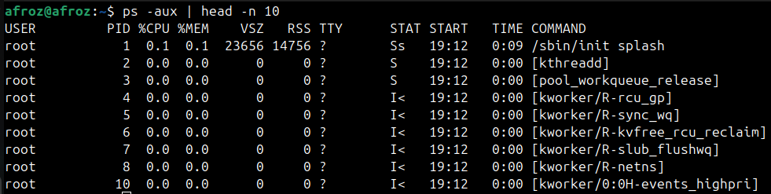
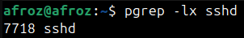
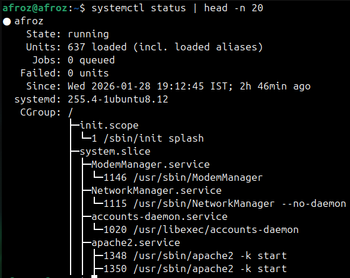
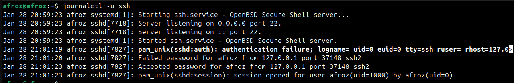
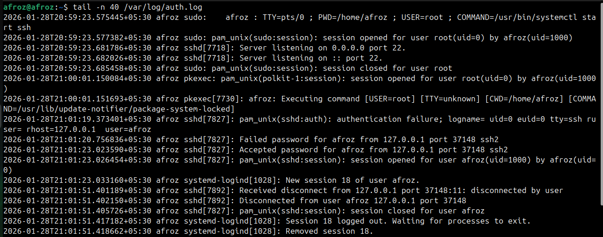
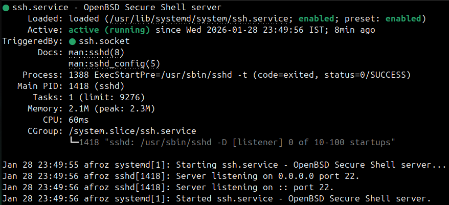
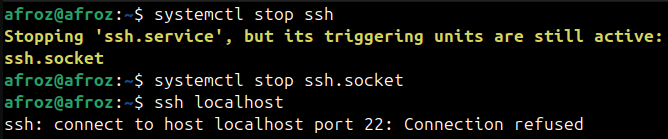
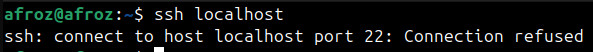
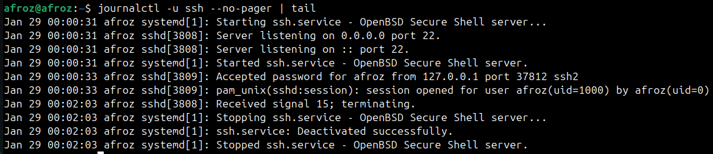
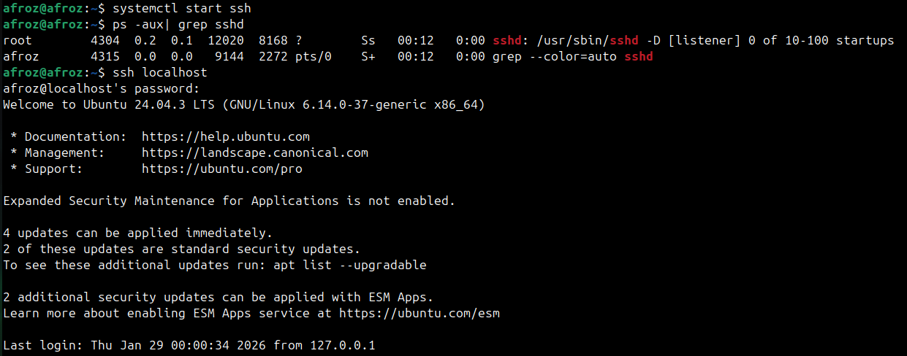

# Real time output of commands I practiced

## Process commands
* `ps -aux | head -n 10` - List running processes(top 10 lines).

* `pgrep -x sshd` - Get the process id by process name.

## Service commands
* `systemctl status | head -n 20` - Prints first 20 lines of system service status summary.

* `systemctl list-units --type=service --state=running | head` - Prints first 10 lines of running services status.

## Log commands
* `journalctl -u ssh` - Displays logs for the SSH service.

* `tail -n 40 /var/log/auth.log` - Last 40 lines of the authentication log(ssh, sudo).

## Service for inspection (SSH)
`systemctl status ssh`

It is running now lets stop it. And try to connect to localhost.

Giving error 

Let's view logs and check

Log shows the service is stopped let's start the ssh service and check again

Service started and localhost connection made
