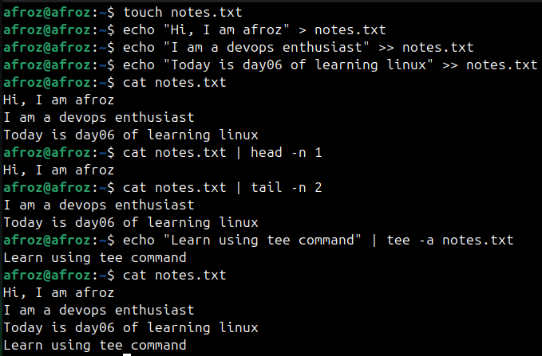

# Read and Write text files in Linux

* `touch notes.txt`

 Create a textfile with name notes.txt

* `echo "Hi, I am afroz" > notes.txt`

 Write to notes.txt

* `echo "I am a devops enthusiast" >> notes.txt`

  `echo "Today is day06 of learning linux" >> notes.txt`
  
 Append to notes.txt

* `cat notes.txt`

 Read notes.txt

* `cat notes.txt | head -n 1`

 Read first line of notes.txt

* `cat notes.txt | tail -n 2`

 Read last two lines of notes.txt

* `echo "Learn using tee command" | tee -a notes.txt`

 Write using tee command that also prints the output to terminal
  -a appends
  
## Hands on of above commands

